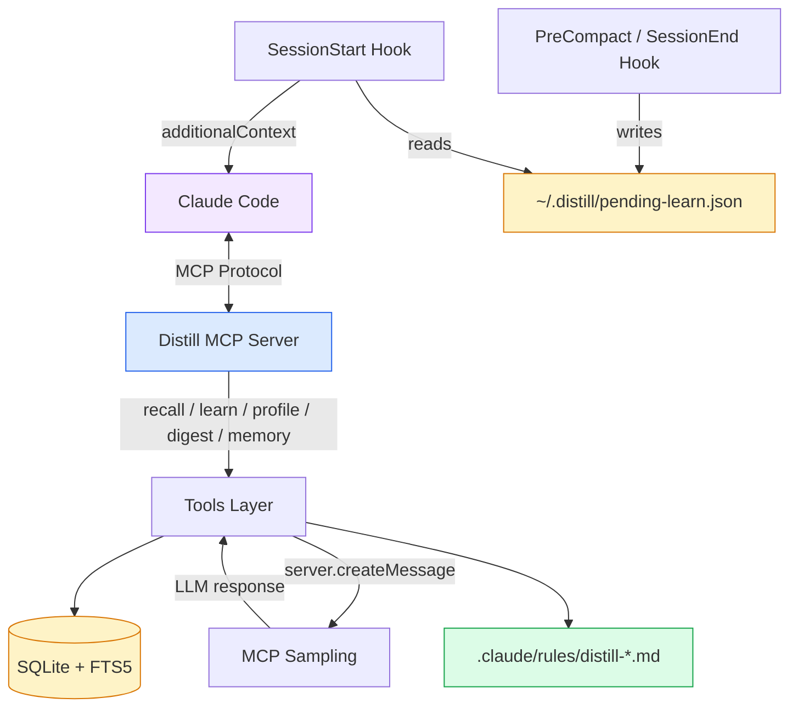
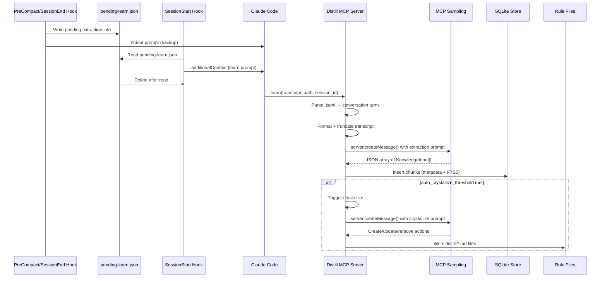
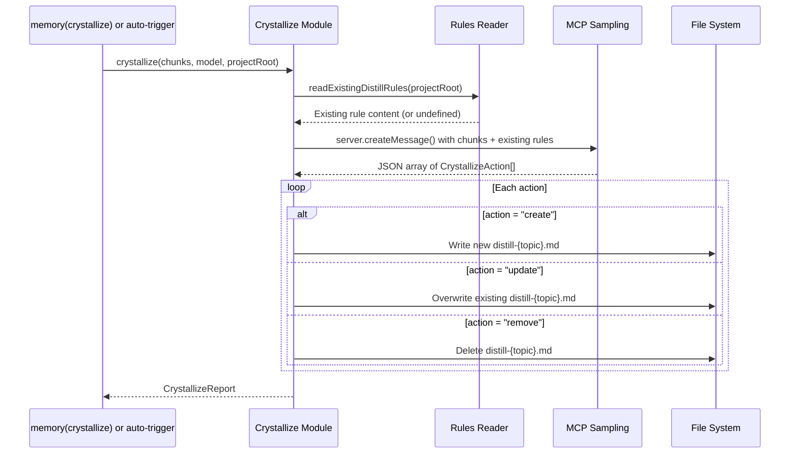

# Architecture

Distill is structured in five layers: **Store**, **Extractor**, **Tools**, **Hooks**, and **Rules**.

## System Overview



## Learn Pipeline



## Crystallize Pipeline



## MCP Sampling

Distill does **not** use a direct API key. Instead, it uses **MCP Sampling** — the MCP server requests LLM completions from the client (Claude Code) via `server.createMessage()`. This means:

- No `ANTHROPIC_API_KEY` needed
- Uses the user's existing Claude subscription (Max, Teams, etc.)
- Model selection is advisory via `modelPreferences.hints`
- The client decides which model actually runs

```typescript
// How MCP Sampling works internally
const result = await server.createMessage({
  messages: [{ role: "user", content: { type: "text", text: prompt } }],
  systemPrompt: EXTRACTION_SYSTEM_PROMPT,
  modelPreferences: {
    hints: [{ name: config.extraction_model }],
    costPriority: 0.8,
    speedPriority: 0.9,
    intelligencePriority: 0.3,
  },
  maxTokens: 4096,
});
```

## Layers

### Store (`src/store/`)

| File | Responsibility |
|------|---------------|
| `types.ts` | `KnowledgeChunk`, `KnowledgeInput`, type/scope/trigger enums |
| `scope.ts` | Resolve storage paths (global: `~/.distill/knowledge/`, project: `.distill/knowledge/`) |
| `metadata.ts` | `MetadataStore` — SQLite CRUD (insert, search, touch, delete, stats, meta key-value) |
| `vector.ts` | `VectorStore` — FTS5 full-text search with sanitized queries |

**SQLite Schema:**
- `knowledge` table with CHECK constraints on `type`, `scope`, `trigger`
- `distill_meta` table for key-value metadata (e.g., `last_crystallize` timestamp)
- Indexes on `scope`, `type`, `project`
- FTS5 virtual table `knowledge_fts` for full-text search
- WAL journal mode for concurrent reads

### Extractor (`src/extractor/`)

| File | Responsibility |
|------|---------------|
| `parser.ts` | Parse `.jsonl` transcripts into user/assistant turn pairs |
| `prompts.ts` | System + user prompt templates for extraction and crystallize |
| `extractor.ts` | Orchestrate: parse → format → truncate → MCP sampling → validate → return `KnowledgeInput[]` |
| `crystallize.ts` | Consolidate knowledge chunks into `distill-*.md` rule files via MCP sampling |
| `rules-reader.ts` | Read existing `distill-*.md` files from global + project scopes for context |

**Per-module model selection:**
- Extraction: Haiku (fast, cheap — runs frequently)
- Crystallize: Sonnet (higher quality — runs infrequently)

**Max transcript size:** 100K characters (truncated from the beginning, keeping recent turns)

### Tools (`src/tools/`)

| Tool | Input | Behavior |
|------|-------|----------|
| `recall` | `query`, optional `type`/`scope` | FTS5 search both scopes, sort by confidence |
| `learn` | `transcript_path`, optional `session_id`/`scope` | Extract + save + auto-crystallize if threshold met |
| `profile` | none | Stats per scope (total, by type, most accessed) |
| `digest` | none | Duplicate detection (Jaccard > 0.7), stale entries |
| `memory` | `action`, `id` | promote/demote/delete/crystallize |

### Hooks (`src/hooks/`)

| File | Responsibility |
|------|---------------|
| `pending-learn.ts` | Shared types and constants (`PendingLearn`, `PENDING_LEARN_PATH`) |
| `distill-hook.ts` | PreCompact/SessionEnd: writes `pending-learn.json` + outputs prompt to stdout |
| `session-start-hook.ts` | SessionStart: reads `pending-learn.json`, returns `additionalContext` JSON |

**Hook flow:**
1. PreCompact/SessionEnd fires → `distill-hook.ts` writes `~/.distill/pending-learn.json`
2. Next session starts → `session-start-hook.ts` reads pending file
3. Hook returns `{ "additionalContext": "[Distill] Please run learn..." }`
4. Claude Code sees the context and calls `learn()`
5. Pending file is deleted after reading (consumed once)

Hooks cannot call `server.createMessage()` directly because they run outside the MCP server process. The pending-learn file bridges this gap.

### Config (`src/config.ts`)

Config file: `.distill/config.json` (project) or `~/.distill/config.json` (global).
Project config overrides global. All fields optional (zero-config).

| Field | Default | Purpose |
|-------|---------|---------|
| `extraction_model` | `claude-haiku-4-5-20251001` | Model hint for extraction |
| `crystallize_model` | `claude-sonnet-4-5-20250929` | Model hint for crystallize |
| `max_transcript_chars` | `100000` | Transcript truncation limit |
| `auto_crystallize_threshold` | `0` (disabled) | Auto-crystallize after N new chunks |

## Rule File Format

Crystallize generates rule files in `.claude/rules/distill-{topic}.md`:

```markdown
# {topic}

> Auto-generated by Distill. Do not edit manually.

- Rule 1
- Rule 2

## Sources

- chunk-id-1
- chunk-id-2
```

These files are automatically loaded by Claude Code as rules context.

## Storage Structure

```
~/.distill/
├── config.json                # Global config (optional)
├── knowledge/                 # Global scope
│   ├── metadata.db            # SQLite database
│   └── metadata.db-wal        # WAL file
└── pending-learn.json         # Pending extraction (transient)

<project>/
├── .distill/
│   ├── config.json            # Project config (optional, overrides global)
│   └── knowledge/             # Project scope
│       ├── metadata.db
│       └── metadata.db-wal
└── .claude/
    └── rules/
        └── distill-*.md       # Generated rule files
```

## Dependencies

| Package | Purpose |
|---------|---------|
| `@modelcontextprotocol/sdk` | MCP server implementation + sampling (`server.createMessage()`) |
| `better-sqlite3` | SQLite with FTS5 support |
| `zod` | Input schema validation |
